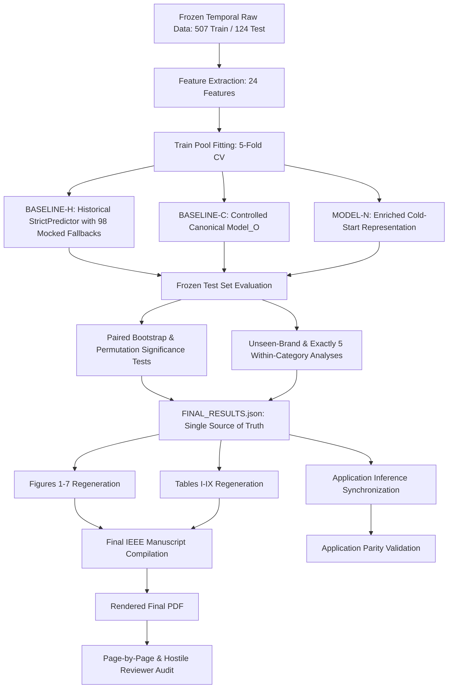

# Artifact Dependency Graph

```mermaid
graph TD
    RawData[Frozen Temporal Raw Data: 507 Train / 124 Test] --> Features[Feature Extraction: 24 Features]
    Features --> TrainPool[Train Pool Fitting: 5-Fold CV]
    TrainPool --> BaselineH[BASELINE-H: Historical StrictPredictor with 98 Mocked Fallbacks]
    TrainPool --> BaselineC[BASELINE-C: Controlled Canonical Model_O]
    TrainPool --> ModelN[MODEL-N: Enriched Cold-Start Representation]
    
    BaselineH --> Eval[Frozen Test Set Evaluation]
    BaselineC --> Eval
    ModelN --> Eval
    
    Eval --> Stats[Paired Bootstrap & Permutation Significance Tests]
    Eval --> Subgroups[Unseen-Brand & Exactly 5 Within-Category Analyses]
    
    Stats --> FinalResults[FINAL_RESULTS.json: Single Source of Truth]
    Subgroups --> FinalResults
    
    FinalResults --> Tables[Tables I-IX Regeneration]
    FinalResults --> Figures[Figures 1-7 Regeneration]
    FinalResults --> AppSync[Application Inference Synchronization]
    
    Figures --> Manuscript[Final IEEE Manuscript Compilation]
    Tables --> Manuscript
    AppSync --> Parity[Application Parity Validation]
    
    Manuscript --> PDF[Rendered Final PDF]
    PDF --> Audit[Page-by-Page & Hostile Reviewer Audit]
```
