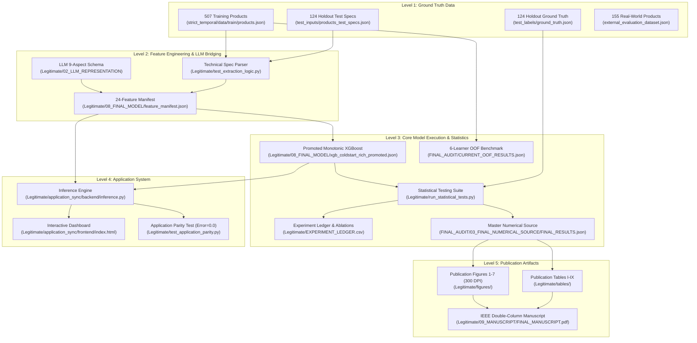

# CURRENT DEPENDENCY GRAPH
**Autonomous Publication Engineering System — Current Modified Project**

```mermaid
graph TD
    subgraph S1 [Level 1: Ground Truth Data]
        D_TRAIN["507 Training Products<br/>(strict_temporal/data/train/products.json)"]
        D_TEST["124 Holdout Test Specs<br/>(test_inputs/products_test_specs.json)"]
        D_LABELS["124 Holdout Ground Truth<br/>(test_labels/ground_truth.json)"]
        D_EXT["155 Real-World Products<br/>(external_evaluation_dataset.json)"]
    end

    subgraph S2 [Level 2: Feature Engineering & LLM Bridging]
        F_EXTRACT["Technical Spec Parser<br/>(Legitimate/test_extraction_logic.py)"]
        F_SCHEMA["LLM 9-Aspect Schema<br/>(Legitimate/02_LLM_REPRESENTATION)"]
        F_MANIFEST["24-Feature Manifest<br/>(Legitimate/08_FINAL_MODEL/feature_manifest.json)"]
    end

    subgraph S3 [Level 3: Core Model Execution & Statistics]
        M_XGB["Promoted Monotonic XGBoost<br/>(Legitimate/08_FINAL_MODEL/xgb_coldstart_rich_promoted.json)"]
        S_STATS["Statistical Testing Suite<br/>(Legitimate/run_statistical_tests.py)"]
        S_LEDGER["Experiment Ledger & Ablations<br/>(Legitimate/EXPERIMENT_LEDGER.csv)"]
        S_OOF["6-Learner OOF Benchmark<br/>(FINAL_AUDIT/CURRENT_OOF_RESULTS.json)"]
        S_JSON["Master Numerical Source<br/>(FINAL_AUDIT/03_FINAL_NUMERICAL_SOURCE/FINAL_RESULTS.json)"]
    end

    subgraph S4 [Level 4: Application System]
        APP_ENG["Inference Engine<br/>(Legitimate/application_sync/backend/inference.py)"]
        APP_UI["Interactive Dashboard<br/>(Legitimate/application_sync/frontend/index.html)"]
        APP_PARITY["Application Parity Test (Error=0.0)<br/>(Legitimate/test_application_parity.py)"]
    end

    subgraph S5 [Level 5: Publication Artifacts]
        PUB_FIGS["Publication Figures 1-7 (300 DPI)<br/>(Legitimate/figures/)"]
        PUB_TABS["Publication Tables I-IX<br/>(Legitimate/tables/)"]
        PUB_MANU["IEEE Double-Column Manuscript<br/>(Legitimate/09_MANUSCRIPT/FINAL_MANUSCRIPT.pdf)"]
    end

    D_TRAIN --> F_EXTRACT
    D_TEST --> F_EXTRACT
    F_SCHEMA --> F_MANIFEST
    F_EXTRACT --> F_MANIFEST
    F_MANIFEST --> M_XGB

    M_XGB --> S_STATS
    D_LABELS --> S_STATS
    S_STATS --> S_JSON
    S_STATS --> S_LEDGER
    D_TRAIN --> S_OOF

    M_XGB --> APP_ENG
    F_MANIFEST --> APP_ENG
    APP_ENG --> APP_UI
    APP_ENG --> APP_PARITY

    S_JSON --> PUB_FIGS
    S_JSON --> PUB_TABS
    PUB_FIGS --> PUB_MANU
    PUB_TABS --> PUB_MANU
```
